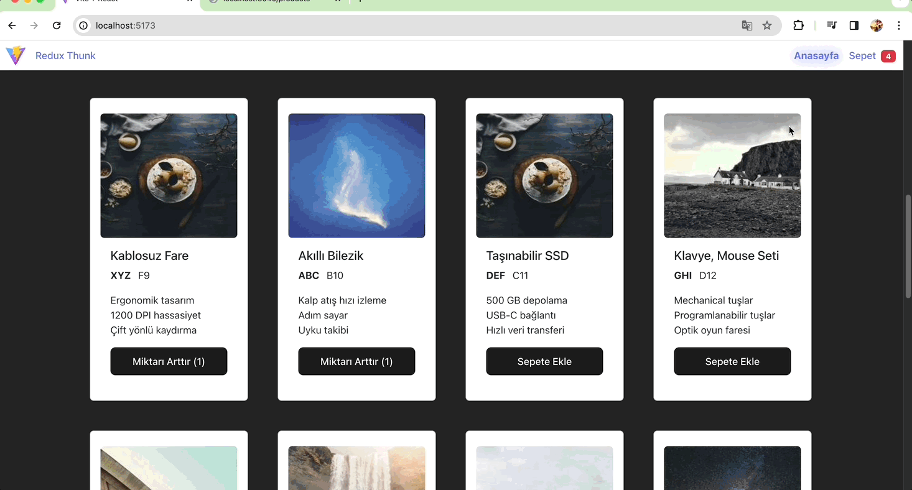

<h1> Redux Thunk Kullanarak Sepet Uygulaması</h1>

Bu proje, Redux Thunk'u kullanarak bir e-ticaret sepet uygulaması geliştirmek için bir örnektir. React ve Redux kullanılarak oluşturulmuştur.

<h2>Proje Açıklaması</h2>

Bu proje, kullanıcıların çeşitli ürünleri görüntüleyebileceği, sepetlerine ekleyebileceği ve sepetlerindeki ürün miktarını güncelleyebileceği bir e-ticaret uygulamasıdır.

- Ana sayfada kullanıcılar ürünleri listeleyebilir ve ürünlerin detaylarına ulaşabilir.
- Ürün detay sayfasında kullanıcılar ürünü sepetlerine ekleyebilir.
- Sepet sayfasında kullanıcılar sepetlerini görüntüleyebilir, sepetlerindeki ürün miktarını artırabilir veya azaltabilir ve alışverişi tamamlayabilirler.

<h2>Kullanılan Teknolojiler</h2>

- React.js
- Redux
- Redux Thunk
- React Router
- Axios
- Bootstrap

<h2>Nasıl Çalıştırılır</h2>

- - Projeyi bilgisayarınıza klonlayın.
- - Terminalde proje dizinine gidin: cd redux-thunk-sepet-uygulamasi
- - Gerekli paketleri yüklemek için npm install komutunu çalıştırın.
- - Projeyi başlatmak için npm start komutunu çalıştırın.
- - Tarayıcınızda http://localhost:3000 adresine giderek uygulamayı görüntüleyebilirsiniz.

<h2>Ekran Görüntüleri</h2>

